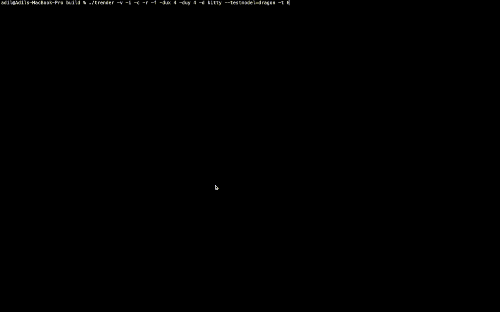

# trender
A CPU-only software 3D renderer that outputs directly to the terminal. Loads a textured OBJ mesh and renders it frame after frame with WASD/QE-and-arrow-key camera controls — no GPU, no windowing system required. Supports Sixel, Kitty, iTerm2, and Unicode half-block display backends.



## Build & Run

Requires CMake 3.16+ and an **AVX2-capable x86-64 CPU** (the rasterizer and encoders are AVX2-only — Apple Silicon Macs are not supported natively). All third-party dependencies (`cglm`, `tinyobj_loader_c`, `stb_image`) are vendored under [src/](src/), so no package manager setup is needed beyond the compiler toolchain.

### Linux
```sh
sudo apt install cmake build-essential   # or your distro's equivalent
mkdir build && cd build
cmake .. && make
./trender -d sixel --testmodel=dragon -i
```

### macOS (Intel)
```sh
brew install cmake
mkdir build && cd build
cmake .. && make
./trender -d iterm --testmodel=dragon -i
```
Use `-d iterm` or `-d kitty` in iTerm2/Kitty for image output; Terminal.app only supports `-d halfblock`.

### Windows (Visual Studio)
1. Install Visual Studio 2022 with the **"Desktop development with C++"** workload (includes CMake, Ninja, and the MSVC toolchain).
2. Open the repository folder in Visual Studio (`File → Open → Folder`) — it auto-detects `CMakePresets.json` and offers `x64-debug` / `x64-release` configurations.
   - *Optional:* if the configurations don't appear (CMake wasn't picked up), find `CMakeLists.txt` in Solution Explorer, open it, then `File → Save` (or `Ctrl+S`) to force CMake configuration to re-run.
3. Select `x64-release`, then `Build → Build All` (or `Ctrl+Shift+B`).
4. Run from a terminal that supports the desired graphics protocol (Windows Terminal recommended):
```powershell
out\build\x64-release\trender.exe -d sixel --testmodel=dragon -i
```

Or from the command line (Developer PowerShell for VS 2022):
```powershell
cmake --preset x64-release
cmake --build out\build\x64-release
```

### WSL (Windows Subsystem for Linux)
WSL2 provides a real Linux environment, so building is identical to the **Linux** steps above — just run them inside your WSL distro's shell (the AVX2-capable-CPU requirement still applies, since WSL2 runs on the same physical CPU):
```sh
sudo apt install cmake build-essential   # inside your WSL distro
mkdir build && cd build
cmake .. && make
./trender -d sixel --testmodel=dragon -i
```
Run it from Windows Terminal — per the **Terminal Support** table below, only `-d sixel` and `-d halfblock` work there (`iterm`/`kitty` won't).

Each example above launches interactively — see **Camera controls** and **Flags** below for the full control scheme and option reference.

### Common run flags
- `-d, --display MODE` — `sixel` | `halfblock` | `halfblock24bpp` | `iterm` | `itermbmp` | `itermjpeg` | `kitty` (required)
- `-i, --interactive` — enables camera controls (see **Camera controls** below)
- `--testmodel=<name>` — use a bundled model (`bmw`, `dragon`, `sponza`, `lost_empire`, `Grass_Block`) instead of a file path
- `-h, --help` — full flag list

See **Flags** below for the complete reference, including performance, display, and camera/autofit options.

### Camera controls
Camera controls are only active when `-i`/`--interactive` is passed — the renderer reads raw key events and does not use the mouse.

| Key | Effect |
|---|---|
| `w` / `s` | Move forward / backward |
| `a` / `d` | Strafe left / right |
| `q` / `e` | Move up / down |
| ← / → | Yaw left / right (10° per press) |
| ↑ / ↓ | Pitch up / down (10° per press, clamped to ±45°) |
| `Q` or `Ctrl+Q` | Quit |

## Flags

| Flag | Default | Notes |
|---|---|---|
| `-d, --display MODE` | *(required)* | `sixel`, `halfblock`/`halfblock216`, `halfblock24bpp`, `iterm`/`itermpng`, `itermbmp`, `itermjpeg`, `kitty` |
| `-W, --width N` | auto | Output width in pixels; 0 or omitted auto-detects from the terminal |
| `-H, --height N` | auto | Output height in pixels; 0 or omitted auto-detects from the terminal |
| `-n, --frames N` | `1` (or `100000` with `-i`) | Number of frames to render; interactive mode effectively runs until quit |
| `-i, --interactive` | off | Enables camera controls — see **Camera controls** above |
| `-r, --rotate` | off | Auto-rotates the model each frame (CLI-only; no runtime toggle key) |
| `-v, --verbose` | off | Prints diagnostic and timing output |
| `-c, --center` | off | Translates the model so its bounding box is at the origin (no scaling) |
| `-f, --autofit` | off | Centers, scales the model to fit, and sets camera distance from the bounding box |
| `-t, --threads N` | `2` | Worker thread count. `--buffers` is forced to `1` when `threads=1`, and must be ≥3 otherwise (deadlock risk) |
| `-B, --buffers N` | `3` | N-way pipeline depth — see **Architecture** |
| `--jpeg-quality N` | `90` | JPEG quality, 1–100; `itermjpeg` only |
| `--png-compression N` | `8` | PNG compression, 0–9; `iterm`/`itermpng` only |
| `--display-upscale-x N`, `-dux N` | `1` | Integer horizontal upscale factor; all pixel backends |
| `--display-upscale-y N`, `-duy N` | `1` | Integer vertical upscale factor; all pixel backends |
| `--testmodel=NAME` | — | Resolves to `resources/<name>/<name>.obj`; use in place of a file path |
| `-h, --help` | — | Prints usage |

## Terminal Support

Only the following terminals are currently supported. Not every `-d/--display` backend works in every terminal — pick one your terminal supports:

| Backend | Windows Terminal | Kitty | iTerm2 |
|---|---|---|---|
| `sixel` | ✅ | ❌ | ✅ |
| `halfblock` | ✅ | ✅ | ✅ |
| `iterm` | ❌ | ❌ | ✅ |
| `kitty` | ❌ | ✅ | ❌ |

| OS | Available terminals |
|---|---|
| Windows | Windows Terminal |
| macOS | iTerm2, Kitty |
| Linux | Kitty |

## Pipeline (per frame)

**1. Load mesh + textures**
- Loads an OBJ file via `tinyobj_loader_c`
- Loads all diffuse textures via `stb_image` and packs them into a single flat **texture atlas** in RGB565 (16-bit) format
- This avoids any per-triangle texture switching during rasterization

**2. Vertex transform**
- Each vertex is multiplied by the model-view-projection matrix to get homogeneous clip-space coordinates

**3. Near-plane clipping**
- Triangles straddling the near plane are clipped: 1 inside vertex → 1 triangle, 2 inside vertices → 2 triangles

**4. Rasterization — index buffer only**
- The frame is divided into a 2D grid of chunks (row strips × column chunks); each chunk rasterizes only the triangles whose bounding box overlaps it, via a precomputed per-chunk hint bitmask
- Uses a half-edge fixed-point algorithm, processing **8 pixels at a time with AVX2**
- For each covered pixel: depth test, perspective-correct UV interpolation, compute atlas texel index
- Writes the atlas texel index (not color yet) into a 32-bit index buffer, and depth into a float depth buffer

**5. Texture sampling pass**
- Walks the index buffer and looks up the atlas to fill a chunk-local RGB565 output buffer

**6. Row combine + encode**
- Once all column chunks of a row have rendered, they're combined into one full-width RGB565 row buffer
- For sixel: quantizes to a **216-color 6×6×6 RGB cube palette** with **Bayer ordered dithering** (16×16 matrix), AVX2-accelerated, 16–32 pixels at a time. Other backends (Kitty, iTerm2, half-block) encode the row directly for their own protocol/format

**7. Display**
- The encoded row is written directly to stdout via the active backend's terminal graphics protocol (Sixel run-length escape sequences, Kitty APC, iTerm2 OSC 1337, or ANSI half-block escapes)

## Architecture

- **Native thread pool + mutex-guarded MPMC queue** drive an explicit task graph (no OpenMP). Task types are `PROCESS_PRIMITIVES → RENDER_FRAME → ENCODE_FRAME → DISPLAY_FRAME`, dispatched to worker threads as their dependencies (tracked via per-frame/per-chunk completion arrays under a mutex) are satisfied
- **2D chunking**: each frame is divided independently along Y (row strips) and X (column chunks); rasterization + texture sampling run per-chunk, then chunks are combined per-row for encoding
- **N-way buffering** (configurable, default 3) pipelines primitive processing, rendering, encoding, and display across multiple frames in flight, so display of frame *N* overlaps rendering of frame *N+1*
- **Kitty backend** uses a round-robin multi-image-id, split transmit/display scheme to work around protocol quirks (re-transmitting an id deletes its placements; combined transmit+display tears mid-frame; animation-frame edits leak storage) — see the header comment in [trender.h](src/trender.h)
- **Input** via raw terminal I/O: `wasd`/`qe` for camera movement, arrow keys to look, left-click raycasts to isolate a single triangle for debugging (see **Camera controls**)
- **Tracing**: an optional built-in event trace (`tio_trace_log.h`) records per-task start/end times per worker thread; the `tio_trace` TUI tool ([src/tio_trace.c](src/tio_trace.c)) replays the log as a colour-coded timeline with a legend, for diagnosing scheduling gaps and load imbalance

## Key Design Decisions

| Decision | Reason |
|---|---|
| RGB565 internal format | Halves memory bandwidth vs RGBA32 |
| Single texture atlas | No branching or state changes mid-rasterize |
| Index buffer → separate texture pass | Decouples rasterization from sampling; lets the depth test run without touching texture memory |
| AVX2 throughout | 8–32× throughput on the inner loops |
| Multiple display backends (Sixel, Kitty, iTerm2, half-block) | Works across terminals with different (or no) graphics protocol support |
| Native thread pool + mutex-guarded MPMC work queue (no OpenMP) | Explicit task graph lets render/encode/display of different frames overlap; avoids OpenMP barrier/fork-join overhead |
| Independent X/Y chunking | Finer-grained parallel units than row-only strips; per-chunk hint bitmask skips triangles that don't overlap it |

## Changelog

**Rendering**
- [x] Initial CPU rasterizer with sixel output
- [x] Refactored rendering — separated rasterization, indexed bitmap conversion, and sixel encoding
- [x] Experimented with triangle drawing approaches; settled on half-edge fixed-point
- [x] Revamped material/texture loading to handle multiple materials; fixed artifacting
- [x] AVX2 rasterizer — 8 pixels at a time with perspective-correct UV interpolation
- [x] RGB565 framebuffer — halved memory bandwidth vs RGBA32
- [x] Single diffuse texture atlas — no per-triangle texture switching
- [x] Separate index buffer pass — depth test decoupled from texture sampling
- [x] Add X-axis chunking alongside existing Y-axis row chunking — independent 2D chunk grid, with per-chunk clipping/overlap hint bitarrays
- [ ] Normal/specular map support
- [ ] Lighting model
- [ ] Fix render and display size calculation of chunks
- [ ] Add full frustum clipping instead of just near plane clipping

**Performance**
- [x] Multi-threading via OpenMP — thread 0 handles I/O, threads 1+ rasterize horizontal strips
- [x] Triple-buffering with OMP locks between render and display threads
- [x] Optimised buffer clearing and RGB565→indexed bitmap conversion
- [x] AVX2-accelerated sixel palette quantization — 16–32 pixels at a time
- [x] Reduced sixel context memory — scratch buffers heap-allocated and shared across buffer slots
- [x] Thread and buffer count configurable at runtime (previously compile-time macros)
- [x] Implement a task queue based multi-threading model — dynamic task distribution across worker threads via a mutex-guarded MPMC work queue
- [x] Replace OpenMP with a native thread pool driving an explicit task graph (`PROCESS_PRIMITIVES → RENDER_FRAME → ENCODE_FRAME → DISPLAY_FRAME`)
- [x] Parallelise vertex processing; fix screen tearing, flickering, and progressive slowdown in the Kitty backend
- [x] Reduce work queue task struct size; optimize primitive pass
- [ ] Independent CLI flag for X/Y chunk counts (currently both hardcoded to thread count)
- [ ] Experiment with lock free approach to queue and scheduling
- [ ] Experiment with hybrid triangle + output chunk based thread mapping during rasterisation stage instead of simple output chunk based mapping

**Platform & compatibility**
- [x] CMake build system
- [x] Windows support (`tio` input layer)
- [x] Linux compatibility fixes
- [x] Intel macOS support (libomp via Homebrew)
- [x] GCC and Clang warning fixes
- [x] Remove OpenMP dependency — native thread pool now handles all multithreading; libomp no longer required
- [x] Add Windows codepage switch for box-drawing characters

**Input & interaction**
- [x] Refactored input handling into `tio` / `tio_input` abstraction
- [x] Ctrl+Fn, Ctrl+mouse, Ctrl+arrow key support
- [x] Fixed Ctrl+mouse move bug
- [x] First-person camera (WASD + QE + arrow keys)
- [x] Left-click ray cast to isolate a triangle for debugging
- [x] Q / Ctrl+Q to quit (fixed loop-exit bug)
- [ ] Alt+key support
- [ ] Experiment with different mouse reporting modes
- [ ] Wire up raycast-based triangle isolation (`ray_cast()` exists in `raycast.h` but is currently unused/dead code)

**CLI tool**
- [x] CLI argument parsing — input file, resolution, frame count, interactive/rotate/verbose flags
- [x] `--autofit` — auto-center and normalize model scale; compute camera distance from bounding box
- [x] `--center` — translate bounding box to origin without scaling
- [x] `--testmodel=<name>` — built-in test model shorthand
- [x] Non-interactive single-frame mode suitable for use in shell pipelines
- [ ] Split sixel encoding and palette conversion into separate modules
- [ ] ANSI art output (16/256-colour escape codes)
- [ ] Add ANSI art display modes — all glyphs, sextant, octant, braille, box drawing chars, etc
- [x] Implement Kitty graphics protocol output (round-robin multi-image-id, split transmit/display)
- [x] Implement iTerm2 inline image protocol output (PNG/BMP/JPEG, configurable quality/compression)
- [x] Implement block drawing characters output (Unicode half-blocks, 216-color or 24-bit true color)
- [x] Add display upscaling flags (`--display-upscale-x/y`) for all pixel backends

**Tooling**
- [x] Build a TUI trace viewer (`tio_trace`) that renders per-task-type, per-worker-thread execution timeline from a trace log
- [x] Add a legend to the trace viewer
- [x] Add gradient shading to events in the trace viewer
